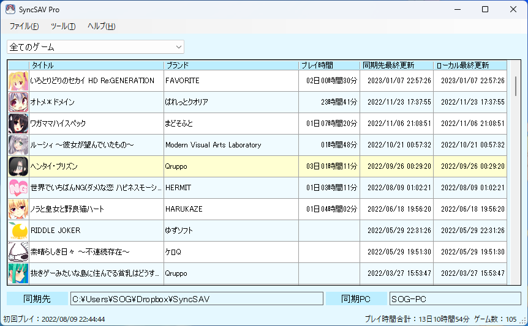
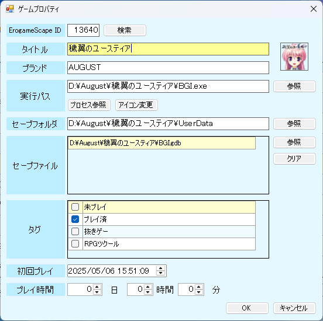
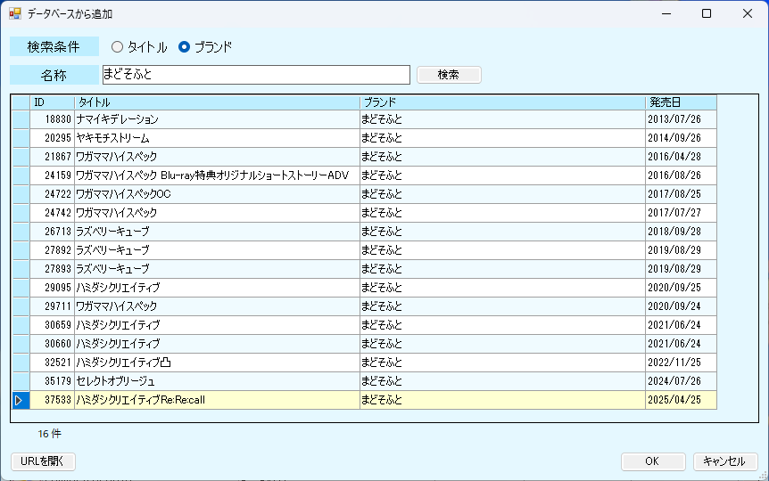
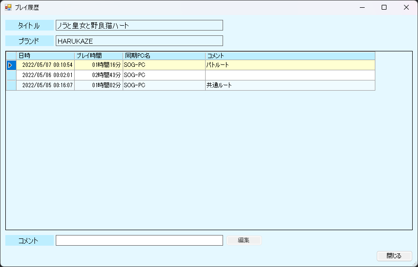

# SyncSAV

## 概観
エロゲのセーブデータ同期ツール

## ダウンロード

[Github](https://github.com/sogsan5/SyncSAV/releases "https://github.com/sogsan5/SyncSAV/releases")

#### 2.0.0
- リリースバージョン

## 使い方

### ゲームを追加する
- タイトルを入力
- ゲームの実行ファイルを参照
- セーブフォルダ又はセーブファイルを参照

ErogameScape -エロゲー批評空間- のデータベースから登録も可能

### ゲームを起動する
起動時にローカルと同期フォルダのセーブデータの最終更新日を比較し、最新のセーブデータをダウンロードします

### プレイ履歴を見る
ゲーム画面がアクティブ時のみ時間をカウントし、同期時にプレイ時間を記録します。

## 動作環境
**Windows 7/8/10/11
**.NET Framework 4.5必須
