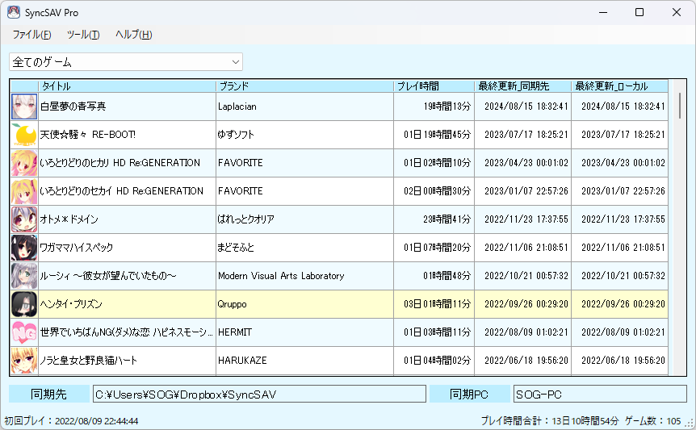
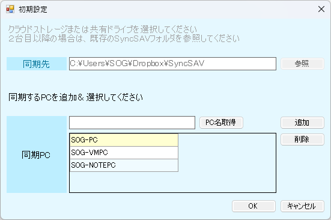
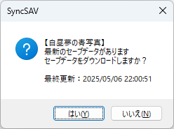
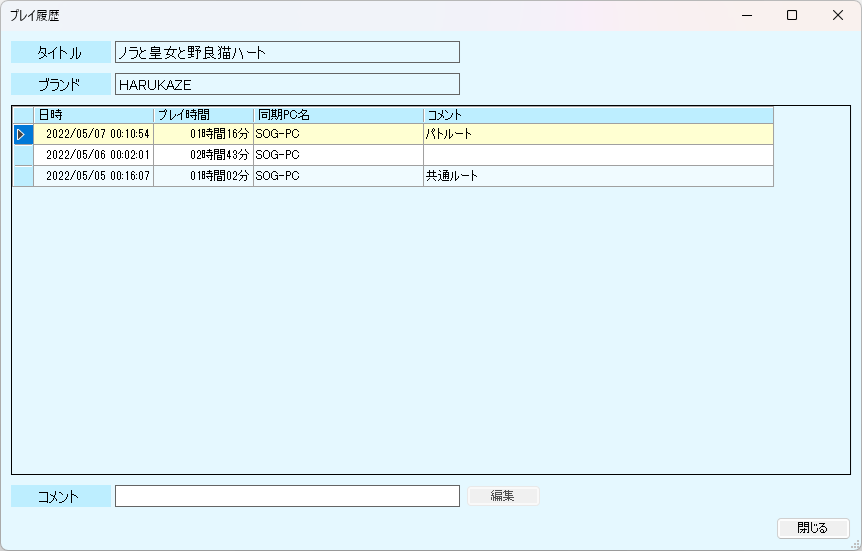

# SyncSAV

## はじめに
このリポジトリは配布専用です。
本ソフトウェアはシェアウェアのため、ソースコードは公開していません。
ソース公開を前提とした利用・改変・再配布は想定していません。

## 概観
エロゲのセーブデータ同期ツール

## ダウンロード

[Github](https://github.com/sogsan5/SyncSAV/releases/download/2.10/SyncSAV_2.10.zip "https://github.com/sogsan5/SyncSAV/releases/download/2.10/SyncSAV_2.10.zip")

[SyncSAV Pro(DLsite)](https://www.dlsite.com/home/work/=/product_id/RJ378750.html "https://www.dlsite.com/home/work/=/product_id/RJ378750.html")

[SyncSAV Pro(Vector)](https://www.vector.co.jp/soft/winnt/util/se524089.html "https://www.vector.co.jp/soft/winnt/util/se524089.html")

## 使い方

### 初期設定
- 同期先を参照（Dropbox、OneDrive、GoogleDrive、共有フォルダなど）
- 2台目以降のPCを設定する場合は、同期先に作成されるSyncSAVフォルダを参照
- 同期するPCを追加＆選択

### ゲームを追加する
- タイトルを入力
- ゲームの実行ファイルを参照
- セーブフォルダ又はセーブファイルを参照

ErogameScape -エロゲー批評空間- のデータベースから登録も可能

### ゲームを起動する
起動時にローカルと同期フォルダのセーブデータ最終更新日を比較し、最新のセーブデータをダウンロードします

### プレイ履歴を見る
ゲーム画面がアクティブ時のみ時間をカウントし、同期時にプレイ時間を記録します。

## LiteとProの比較
| 項目| SyncSAV Lite | SyncSAV Pro |
| ---- | ---- | ---- |
| ゲーム登録数 | 5件まで | 無制限 |
| ゲーム開始時 | 手動で同期が必要 | 最新セーブデータを自動で同期 |
| ゲーム終了時 | 手動で同期が必要 | 終了を検知しセーブデータを自動で同期 |
| プレイ時間 | 手動で入力が必要 | 同期時に自動で記録 |

## 動作環境
**Windows 7/8/10/11**

**NET Framework 4.7.2必須**
